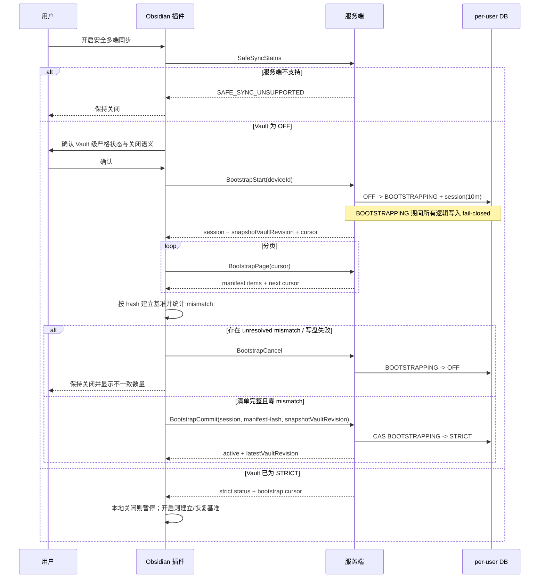
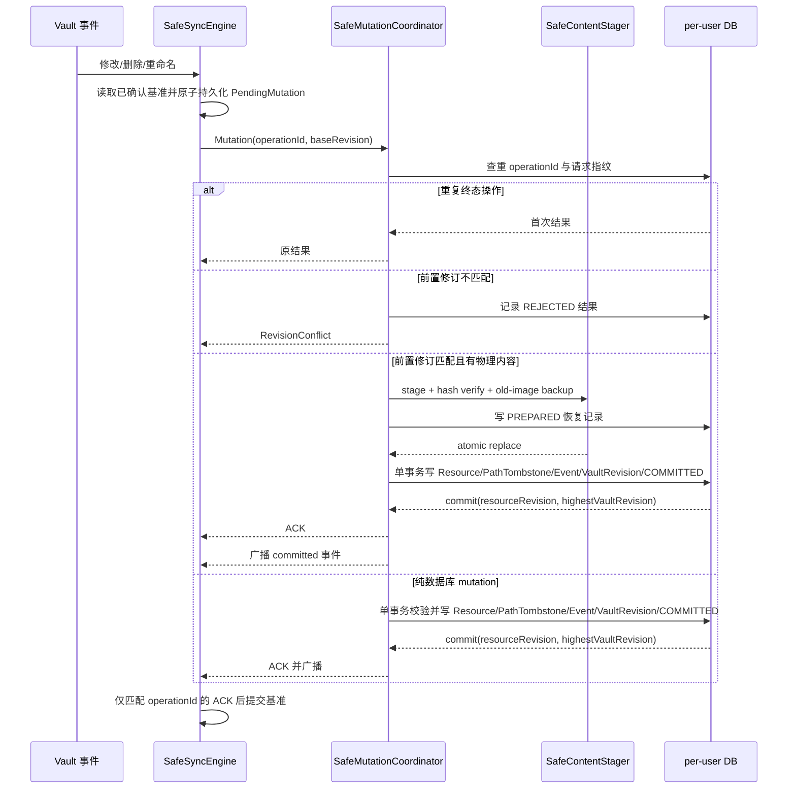

# 安全修订同步第一阶段设计

## 0. 术语约定

| 术语 | 定义 | 防冲突结论 |
| --- | --- | --- |
| 安全修订同步 | 本 feature 交付的第一阶段能力，仅覆盖修订、幂等、安全修改/删除/重命名和客户端保护 | 不等同于后续权威镜像或设备角色 |
| Resource ID | 服务端为笔记、附件和文件夹分配的稳定不可预测标识；从本 feature 接管资源后，重命名和墓碑沿用 | 不使用路径或 `pathHash` 充当稳定身份，也不猜测迁移前无法证明的历史重命名关系 |
| Resource Revision | 某一 Resource ID 的单调修订号，任意可观察状态变化都递增 | 与笔记现有 `Version` 快照语义分离 |
| Vault Revision | Vault 内每个已提交同步事件的单调序号，用作增量游标 | 不再把毫秒时间戳作为安全游标；递归操作可提交一段连续事件，ACK 返回最高水位 |
| 操作日志 | 以用户、Vault、设备和 `operationId` 唯一定位的幂等结果记录 | 不等同于现有展示型同步日志 |
| 严格 Vault | 已在服务端持久启用安全修订同步的 Vault | 单台设备关闭本地开关不能解除严格状态 |
| 本地基准 | 插件最后收到服务端 ACK 后持久化的 Resource ID、Revision、Content Hash 和 Vault Revision | 未收到 ACK 的 pending 不能成为基准 |
| 恢复区 | 插件目录内排除同步的 30 天本地原像存储 | 不等同于服务端回收站或 Obsidian 系统回收站 |

## 1. 决策与约束

### 需求摘要

面向同一 Vault 的 Windows 与 Android 设备，增加一个默认关闭的“安全多端同步”设置。服务端和插件均支持且用户确认开启后，Vault 进入严格模式；修改、删除和重命名必须基于已确认修订，过期操作返回冲突且不改变目标数据。客户端接收远端删除前必须验证本地基准并保存恢复原像。

服务端第一阶段只在 `user-database.type=postgres` 且迁移校验完成时宣告安全修订 capability。主数据库可继续使用现有 SQLite；原先分散在多个 SQLite 用户库文件中的 Note/File/Folder/Vault 等用户数据先可重入导入 PostgreSQL 的 `user_<uid>` schema，再切换用户库配置。SQLite 多文件模式继续提供旧同步，但不能激活严格 Vault。

成功标准：

- 顺序操作产生连续修订并在设备间传播。
- 基于旧修订的修改、删除和重命名不落库、不广播。
- 相同 `operationId` 重试返回原结果，不重复生成版本或事件。
- 严格 Vault 拒绝旧客户端或关闭本地开关的客户端写入。
- 远端删除不会直接删除本地未提交或未知基准内容。
- 用户只能在设置中显式确认后激活；服务端不支持时开关不可启用。
- SQLite 多文件用户库或未完成迁移校验的服务端不宣告 capability，不允许进入 BOOTSTRAPPING。
- Dokploy 升级可回滚，Obsidian 桌面和 Android 使用同一协议语义。

明确不做：

- 不实现 `MirrorPlan`、`MirrorApply`、整批回滚和权威覆盖。
- 不实现本地发布端、远端镜像端、设备租约和自动单向同步。
- 不同步 `.obsidian` 配置。
- 不以 `mtime` 自动裁决并发冲突。
- 不向原作者仓库创建 PR；先在用户 fork 和自用环境验证。
- 不自动执行 Git push、合并或删除分支。
- 不为 SQLite 多文件用户库实现跨文件伪事务，也不在未迁移数据上启用严格模式。

### 复杂度档位

- Robustness = L3：所有协议输入、失败路径和重试必须有明确结果。
- Structure = layers：沿用 handler/service/repository 分层，修订决策集中在领域服务。
- Performance = budgeted：Vault 事件查询分页；20,000 资源不能一次加载正文。
- Testability = verified：核心修订不变量、幂等和旧客户端矩阵必须有自动化证据。
- Compatibility = cross-version：严格模式关闭时保持当前协议；开启后 fail-closed。
- Idempotency = exactly-once within retention：30 天操作日志窗口内同一操作只产生一次结果。
- Concurrency = distributed：多设备和服务重启下由数据库事务而非进程内锁决定顺序。
- Security = validated：用户/Vault/权限/能力绑定；设备 ID 不替代认证。

### 关键决策

1. **Vault 级严格模式，而非仅本地布尔分支。** 仅在客户端分支会让旧设备继续执行无条件删除，无法满足安全目标。
2. **Resource Revision 独立于 Note.Version。** 现有 `Version` 只随正文快照演进；复用会把删除、重命名和历史逻辑耦合。
3. **Resource ID 跨重命名和墓碑保持不变。** `SyncResourceMetadata` 只保存唯一当前状态；旧路径写入独立 `SyncPathTombstone`。同一操作对每个 Resource 只增加一次 Resource Revision，墓碑引用该新 Revision。
4. **Vault Revision 由 per-user 数据库事务分配。** 每次逻辑提交同时写资源状态、事件和最终操作结果；正文/附件位于文件系统时先进入 durable staging，未恢复为 `COMMITTED` 前不 ACK、不广播。
5. **操作日志终态保留 30 天。** 覆盖移动端长期离线和网络重试；只清理 `COMMITTED/REJECTED` 终态，`PREPARED` 必须先完成恢复，客户端不得重发已超过保留期的 pending。
6. **开启严格模式不可由单台设备静默关闭。** 新插件本地关闭开关时，若服务端已严格启用，则暂停该 Vault 同步并提示重新开启；全局解除不在本阶段提供。
7. **激活使用可取消 bootstrap session。** 首次激活原子进入 `BOOTSTRAPPING` 并冻结该 Vault 的逻辑写入；插件完成一致清单且零 unresolved mismatch 后以 CAS 提交为 `STRICT`，超时、取消或失败恢复 `OFF`。
8. **设置 UI 沿用 Obsidian 原生 Setting。** 使用 toggle、状态文本和确认 Modal，不新增视觉主题、装饰卡片或独立页面。
9. **严格写入守卫位于 service/domain 边界。** WebSocket、REST、MCP、Git sync、回收站恢复和其他逻辑写入口都不能绕过；本阶段只有新安全协议携带 `SafeMutationContext` 时可写，其他入口返回稳定升级错误。
10. **Resource 当前状态与路径墓碑分离。** 一个 Resource ID 只有一条当前状态；旧路径由 `SyncPathTombstone` 记录。一次重命名对每个受影响 Resource 只增加一次 Resource Revision。
11. **附件以 start/chunk/commit 三阶段接入幂等操作。** 上传 session 绑定用户、Vault、设备、operationId、请求指纹与期望 hash；只有 commit 校验 hash 后才能产生资源与 Vault Revision。
12. **客户端状态按服务端身份隔离并双写。** baseline/pending 的命名空间绑定 `serverFingerprint + uid + vaultId`，同时写插件私有文件镜像，不能只依赖移动端可被清理的 localStorage。
13. **第一阶段以 PostgreSQL 用户库作为严格同步前提。** Dokploy 复用现有 PostgreSQL 公用服务；主数据库可以保留 SQLite，`user-database` 指向 PostgreSQL 后，现有仓储键统一映射到 `user_<uid>` schema。迁移工具先从分散 SQLite 用户库导入全部用户级模型并核对数量和关键字段，再允许 capability；SQLite 和未完成校验的 PostgreSQL 保持安全同步 unsupported。

拒绝方案：

- 仅补 `baseHash`：附件、文件夹、删除和重命名没有正文 hash，且无法提供 Vault 级事件顺序。
- 仅使用现有 `UpdatedTimestamp`：并发更新可能同毫秒，且客户端时钟和服务重启语义不充分。
- 仅在收到删除时检查 `mtime`：无法证明内容仍等于已确认基准。
- 直接实现权威覆盖：当前协议还不能安全表达破坏性前置条件。

### 前置依赖和假设

- 假设 Dokploy 当前服务使用单实例和持久化 `storage`、`config` 卷；部署前必须实地核验。
- 用户已确认复用 Dokploy 的 PostgreSQL 公用服务；部署时必须核验内部地址、数据库名、最小权限账号和持久卷，不在仓库或日志保存凭证。
- 假设所有会写该 Vault 的设备都能先更新到新插件；否则严格模式激活应被阻止或旧设备保持只读失败。
- 假设恢复区采用 `.obsidian/plugins/fast-note-sync/recovery/safe-sync/`，并由现有排除规则永久跳过。
- 安全同步表与 Note/File/Folder/Vault 必须位于 PostgreSQL 同一 `user_<uid>` schema；主数据库 SQLite 不参与安全 mutation 事务。
- 从旧 SQLite 用户库切换前必须完成只读盘点、备份、可重入导入和校验；导入失败或数量/关键字段不一致时不得修改 `user-database` 配置。
- 版本化迁移必须显式执行；当前容器 entrypoint 不会自动运行 `upgrade`。
- 当前插件测试基线存在 `test:auth`、`test:mirror` 已知失败，实现前先归因并修复。
- 原作者 PR 延后到自用验证完成后，当前不配置或调用 upstream PR 流程。

### Top 3 风险与缓解

1. **部分设备激活造成混合协议写入。** 激活时检查能力；严格 Vault 对所有缺修订写入 fail-closed；兼容矩阵测试覆盖。
2. **SQLite 到 PostgreSQL 导入遗漏或修订分配不原子。** 先做只读 dry-run 盘点和全量备份；导入按用户/schema 可重入，核对表数量、主键和资源关键字段；新状态通过版本化迁移回填并由事务级不变量测试覆盖。
3. **客户端 ACK 丢失或乱序推进错误基准。** pending 操作持久化；只按匹配的 `operationId` 和更高 Revision 提交；断线重试测试覆盖。

## 2. 名词与编排

### 2.1 名词层

#### 现状

- 服务端 Note、File、Folder 以路径和 `pathHash` 查询，删除使用 `action=delete` 软删除；只有 Note 有用于内容快照的 `Version`。
- `NoteModifyOrCreateRequest` 支持 `baseHash`，删除和重命名 DTO 只有路径、路径哈希和上下文。
- 插件 FileHashManager 保存 `path -> contentHash/mtime/size`，pending Map/Set 只保存 hash 或路径。
- WebSocket v2 已能协商窗口和 protobuf 能力，客户端 URL 已携带版本。
- 插件已有 `readonlySyncEnabled`，但它只禁止上行，不建立严格服务端状态。

#### 变化

新增领域值对象：

```text
MutationPrecondition:
  resourceId
  baseRevision
  baseHash
  expectedPathState

MutationIdentity:
  deviceId
  operationId

MutationResult:
  resourceId
  resourceRevision
  vaultRevision
  contentHash
  outcome
```

新增持久实体：

- `SafeSyncMigrationState`：per-user schema 内唯一的 SQLite 导入验证记录；普通 schema migration 不写 VERIFIED，只有全表导入、数量/主键/关键字段摘要校验和回填在同一事务提交后才写入。
- `VaultSyncState`：`OFF/BOOTSTRAPPING/STRICT`、最新 Vault Revision、bootstrap session/过期时间和激活信息。
- `SyncResourceMetadata`：Resource ID、类型、当前 Revision、唯一当前路径、内容 hash 和存活/墓碑状态。
- `SyncPathTombstone`：旧路径、Resource ID、产生它的 Resource/Vault Revision 和 transactionId；不是第二份 Resource 当前状态。
- `SyncEvent`：按 Vault Revision 追加的修改、删除、重命名事件。
- `SyncOperation`：幂等请求指纹、`PREPARED/COMMITTED/REJECTED` 状态、staging/恢复信息和首次结果；终态默认保留 30 天。
- `ClientRevisionBaseline`：插件本地 path、Resource ID、Revision、hash、最新 Vault Revision，按 server/user/vault 命名空间存储。
- `PendingMutation`：完整请求载荷、操作 ID、创建时间、服务端保留期限和重试状态，替代只保存 hash/路径的安全模式 pending。

迁移与激活回填规则：

- 新表注册到每个 PostgreSQL `user_<uid>` schema 的版本化迁移；迁移可重入地枚举现有用户，不能只迁移主库。
- SQLite 导入先按现有 repository key 读取分散用户库，将全部用户级模型保留主键导入同一 `user_<uid>` schema；重复执行使用稳定来源标识和主键校验，不重复插入或覆盖不一致目标。
- 导入完成报告至少包含每用户每表源/目标数量、最大主键与 Note/File/Folder/Vault 关键字段摘要；任一不一致使迁移状态保持未验证，服务端不宣告 capability。
- 每个现有 live 或 delete 记录获得不可预测 Resource ID 与初始 Revision 1；只有现有记录能无歧义证明属于同一次 rename 时才关联，不能按文件名/时间猜测历史身份。
- `OFF` 状态继续保持旧协议外部行为，不把旧客户端强制升级；`BootstrapStart` 必须先在 per-user 写队列内进入 `BOOTSTRAPPING`，冻结逻辑写入，再扫描当前 Note/File/Folder 状态并补齐/校正 metadata 后生成 manifest。
- 初始 manifest 不伪造历史事件；Vault Revision 从 0 开始，STRICT 后的 committed 事件才进入增量流。

协议示例：

```text
输入: Delete(path="a.md", resourceId="r1", baseRevision=7, operationId="op1")
当前: Resource("r1").revision == 7
输出: Deleted(resourceRevision=8, vaultRevision=104)

输入: 同一 op1 再次请求
输出: 原样返回 Deleted(8, 104)，无新事件

输入: Delete(... baseRevision=7, operationId="op2")
当前: Resource("r1").revision == 8
输出: RevisionConflict(expected=7, actual=8)，数据不变
```

创建规则：

```text
Create(path="new.md", resourceId="", baseRevision=0,
       expectedPathState=ABSENT, operationId="op-create")
=> 服务端校验目标路径不存在，分配 Resource ID，提交 Revision 1

已有资源的修改/删除/重命名
=> resourceId 必填且 baseRevision > 0；Resource ID、当前路径和 baseRevision 必须同时匹配
```

首阶段协议动作与最小载荷：

- `SafeSyncStatus`：返回 capability、Vault 状态和 latestVaultRevision。
- `SafeSyncBootstrapStart/Page/Commit/Cancel`：session 默认 10 分钟；page item 包含 resourceId/type/path/state/resourceRevision/contentHash/size，响应携带不可伪造 cursor、snapshotVaultRevision 与 manifestHash。
- `SafeNoteMutation`、`SafeFolderMutation`：携带 `deviceId/operationId/resourceId/baseRevision/baseHash/expectedPathState/action`。
- `SafeFileUploadStart`：建立并恢复绑定 operationId 的 chunk session；`SafeFileUploadCommit` 校验 size/hash 后进入 coordinator。
- `SafeSyncEvents`：按 Vault Revision 分页读取 committed 事件；低于服务端可提供下限时返回 `REBOOTSTRAP_REQUIRED`。
- 稳定错误码至少包含 `SAFE_SYNC_UNSUPPORTED`、`SAFE_SYNC_BOOTSTRAP_IN_PROGRESS`、`SAFE_SYNC_STRICT_REQUIRED`、`REVISION_CONFLICT`、`PATH_STATE_CONFLICT`、`OPERATION_ID_REUSED`、`OPERATION_EXPIRED`、`REBOOTSTRAP_REQUIRED`。
- `SafeSyncStatus` 只有在有效用户库为 PostgreSQL且迁移校验完成时返回 capability；SQLite 或迁移未验证返回 `SAFE_SYNC_UNSUPPORTED`，不创建 bootstrap session。

设置状态：

```ts
type SafeRevisionSyncState =
  | "disabled"
  | "unsupported"
  | "activating"
  | "bootstrapping"
  | "active"
  | "strict-vault-local-disabled"
  | "error";
```

#### Interface 设计检查

- Module：服务端 `SafeMutationCoordinator` 主导安全写入；`SafeSyncUnitOfWork` 提供 per-user DB 事务；`SafeContentStager` 处理正文/附件 staging 与恢复；`StrictVaultWriteGuard` 位于资源 service 写边界。
- Interface：调用者提供已认证上下文、Vault、资源类型、操作身份和前置条件；成功返回修订，冲突返回结构化错误。路由层不能自行决定 strict 或绕过 guard。
- Seam：所有 Note/File/Folder 逻辑写入进入 service 时先过 guard；新 WebSocket 动作携带 `SafeMutationContext` 进入 coordinator，REST/MCP/Git sync/旧 WebSocket 在 `STRICT` 或 `BOOTSTRAPPING` 下 fail-closed。
- Depth / locality：幂等、修订、路径状态、事件与结果隐藏在 coordinator/UoW；文件系统的 staged/replace/recover 隐藏在 stager；现有 repository `ExecuteWrite` 不能在 UoW 内嵌套调用，安全 adapter 必须使用 UoW 提供的 `*gorm.DB`。
- Dependency strategy：in-process + local-substitutable；生产使用 per-user GORM DB 与同卷 staging，测试使用临时 SQLite 和临时文件系统。
- Adapter：不新增远程 adapter；WebSocket protobuf 是现有跨仓库契约。
- Test surface：修改、删除、重命名、递归文件夹、重复/过期操作、非 WebSocket 绕过、迁移以及每个 `PREPARED` 崩溃点均从公共接口观察。

接口候选比较：

- 候选 A：在 Note/File/Folder service 各自实现修订。局部直观，但幂等与事务语义会复制三份。
- 候选 B：新增统一 coordinator，由各资源 adapter 提供读取/写入。复杂度集中、便于不变量测试。
- 选择 B；资源 adapter 只承载真实类型差异，不暴露数据库细节给 handler。

客户端对应 `SafeSyncEngine` 作为本地状态机，Vault 事件监听和 WebSocket receive operator 只提交意图，不直接决定修订或删除。baseline 与 pending 通过 `SafeSyncStateStore` 原子写插件私有 JSON 文件（临时文件 + rename），localStorage 仅作缓存；文件损坏或 pending 超过服务端保留期时 fail-closed 并重新 bootstrap。

### 2.2 编排层

#### 现状

当前拓扑是事件监听/全量扫描进入 Note、File、Folder operator，再经 WebSocket handler 调用各 service；差异决策和删除分支分散，增量游标主要是 `lastTime`。远端删除到达后客户端直接调用 Vault 删除。

#### 变化



Bootstrap 本地判定：远端 live、本地缺失时允许下载并校验后成为基准；两端 hash 一致直接成为基准；本地独有、两端 hash 不同、远端墓碑但本地仍存在均记为 unresolved mismatch，不上传、不删除、不提交激活。session 超时或服务重启后由服务端恢复/取消 `BOOTSTRAPPING`，不得永久锁住 Vault。



`PREPARED` 与物理替换之间任一点崩溃时，服务启动和下一次资源访问都必须先运行 recovery：目标 hash 匹配则完成逻辑提交，否则用 old-image 恢复；恢复完成前读取返回可重试错误，绝不 ACK 或广播。staging、目标与 old-image 必须位于同一持久卷，保证 rename 的原子边界。

远端删除流程：

1. 按 Resource ID/Revision 去重。
2. 检查本地是否存在 pending、是否有已确认基准、当前 hash 是否等于基准。
3. 任一检查失败则不删除，生成删除-修改冲突。
4. 检查通过后把原像写入恢复区并验证可读。
5. 删除本地文件，提交新基准；恢复区写入失败则删除失败且基准不前进。

流程级约束：

- `SafeSyncUnitOfWork` 在 per-user 写队列内开启数据库事务；Resource、PathTombstone、SyncEvent、Vault Revision 和最终 SyncOperation 必须同事务提交，COMMITTED 才能 ACK 和广播。
- 物理内容使用 staging + old-image + recovery；`PREPARED` 不是客户端可见成功，不能推进 Resource/Vault Revision 或 baseline。
- `operationId` 必须绑定用户、Vault、设备、动作和规范化请求指纹；同 ID 不同载荷返回 `OPERATION_ID_REUSED`。
- 每个 Vault Revision 唯一且严格递增；递归文件夹操作为每个受影响 Resource 写事件并共享 transactionId，ACK 返回该批最高 Vault Revision；任一子项失败则整批不提交。
- 每个受影响 Resource 在一次操作中只增加一次 Resource Revision；旧路径 tombstone 只引用结果 Revision，不复制一条“当前资源”。
- 客户端只接受高于已确认 Revision 的事件；相同 Revision 幂等忽略，低 Revision 记录诊断后忽略。事件游标落后于保留窗口时强制 re-bootstrap。
- bootstrap 未完成、manifest hash/CAS 失败、清单分页中断、本地基准不可写或存在 unresolved mismatch 时保持 paused；首次激活取消/超时回到 OFF，绝不把缺失解释为删除。
- `user-database` 不是 PostgreSQL或 SQLite 导入尚未验证时，安全同步 capability 为 false；不得用进程锁、多个 SQLite 文件顺序提交或补偿写伪装为原子事务。
- STRICT/BOOTSTRAPPING 的 service 写守卫覆盖 WebSocket、REST、MCP、Git sync、回收站恢复和管理员资源写入；只读、FTS 重建和不改变逻辑状态的计数修复进入显式 allowlist。
- 附件 upload session 不能产生 revision；只有绑定 operationId 的 commit 校验最终 size/hash 后才进入 coordinator，重复 commit 返回首次结果。
- 客户端 pending 超过服务端 30 天终态保留窗口时标记 expired，不再发送；先保留本地内容并 re-bootstrap/人工处理。`PREPARED` 服务端记录不参与终态清理。
- 日志记录操作 ID、设备 ID、资源 ID、旧/新修订和结果，不记录正文、令牌、staging 内容或恢复包内容。

### 2.3 挂载点清单

1. per-user 数据库 schema：Vault 状态、Resource 当前状态、PathTombstone、事件、操作日志与 bootstrap session — 新增。
2. DAO/service：`SafeSyncUnitOfWork`、`SafeContentStager`、`SafeMutationCoordinator`、`StrictVaultWriteGuard` 及启动恢复 — 新增。
3. protobuf/WebSocket capability、status/bootstrap/events、安全 mutation 与附件 start/commit 动作 — 新增和扩展。
4. 插件设置 key `safeRevisionSyncEnabled`（默认 `false`）及设置页 toggle/status/确认 Modal — 新增。
5. 插件 `SafeSyncStateStore`、revision baseline、pending journal、device ID 和恢复区 — 新增。
6. Dokploy fork 镜像来源、PostgreSQL 公用服务内部连接、SQLite 用户库导入、显式版本化迁移、staging/storage/config 持久卷与回滚点 — 修改部署配置。
7. 本机 Obsidian 插件安装目录中的 `main.js`、`manifest.json`、`styles.css` — 更新发布产物。

### 2.4 推进策略

1. 建立可归因测试基线：修复插件现有测试入口并统一测试命令。
2. 建立 PostgreSQL per-user 修订 schema、SQLite 用户库可重入导入、版本化回填、UoW、staging/recovery 和 strict write guard；先证明迁移校验、崩溃点、绕过入口和原子不变量。
3. 扩展 capability、status/bootstrap/events、创建/修改/删除/重命名和附件 start/commit 协议；默认关闭时保持现有外部行为。
4. 接入 coordinator：STRICT 下覆盖所有逻辑写入口，文件夹递归操作逐资源记 revision/event 且整批失败不部分提交。
5. 接入客户端状态机：按 server/user/vault 双写 baseline/pending，保护远端删除，处理 bootstrap mismatch、过期 pending 和恢复区。
6. 接入设置激活 UX：能力、确认、BOOTSTRAPPING、暂停、本地关闭不降级、错误与移动端布局。
7. 完成兼容、安全和端到端验证：覆盖 SQLite unsupported、迁移未验证、断线、重试、PREPARED 崩溃恢复、时钟偏差、非 WebSocket 绕过、旧客户端、服务重启和分页中断。
8. 自用发布：构建 fork 镜像，备份 SQLite/config/storage，dry-run 并导入 Dokploy 公用 PostgreSQL，校验后切换 `user-database`，再更新本机插件并执行非破坏性 smoke；删除/镜像类真实数据验证仍使用复制 Vault。

### 2.5 结构健康度与微重构

#### 评估

- 文件级：服务端 `ws_note.go` 1271 行、`ws_file.go` 1452 行；客户端 `operator_note.ts` 717 行、`operator_file.ts` 1530 行、`setting.tsx` 2099 行，均已偏胖。
- 文件职责：上述文件混合协议解析、同步决策、状态更新和 UI 拼装；继续写入核心修订逻辑会增加职责。
- 改动密度：安全修订会触及多个入口，但可通过新 coordinator/engine 将原文件限制为薄挂钩。
- 目录级：服务端 websocket_router 15 个文件、domain 16 个文件；插件 sync 15 个文件、storage 5 个文件。目录已有分层语义，本次各新增少量专责模块，不需要重组目录。
- compound 检索未发现现有目录或命名 convention。

#### 结论：不做前置微重构

原因：本 feature 的安全风险来自新协议语义，先大范围搬动旧同步代码会扩大不可归因 diff。实现必须把新逻辑放入专责新 module，原胖文件只保留最小挂钩；若实现阶段出现需要改变旧函数签名或模块职责的情况，回到设计确认，不在本 feature 偷做重构。

#### 超出范围的观察

- `setting.tsx` 与四个 operator 文件长期应按功能域拆分，但这会改变调用和归属边界，建议在本 feature 稳定后单独执行重构。

## 3. 验收契约

### 3.1 关键场景

| ID | 输入 / 触发 | 期望可观察结果 |
| --- | --- | --- |
| AC-01 | 新服务端 + 新插件，开关保持关闭 | 当前同步行为不变，安全 mutation 不发送 |
| AC-02 | 服务端版本不支持、用户库仍为 SQLite 或 PostgreSQL 迁移未验证时尝试开启 | toggle 恢复关闭，显示不支持状态，不写本地 active，服务端不创建 bootstrap session |
| AC-03 | 支持 capability 且用户确认开启，manifest 完整且零 mismatch | 服务端完成 `OFF -> BOOTSTRAPPING -> STRICT` CAS，bootstrap 写入基准后 UI 显示 active |
| AC-04 | 同一资源按 Revision 7 顺序修改 | 服务端提交 Revision 8 和新 Vault Revision，其他设备收到一次 |
| AC-05 | 两设备都基于 Revision 7 修改 | 第一项成功，第二项收到冲突且任一正文不被静默丢失 |
| AC-06 | 过期设备基于 Revision 7 删除当前 Revision 8 | 服务端拒绝，不生成墓碑或广播 |
| AC-07 | 重命名目标已存在或旧 Revision 过期 | 整个重命名失败，旧路径与目标路径均不被部分改变 |
| AC-08 | 相同 operationId 或附件 commit 在断线后重发 | 返回首次结果，Revision、事件和历史各只增加一次；同 ID 不同指纹被拒绝 |
| AC-09 | 远端删除到达，本地有 pending 或 hash 偏离 | 本地文件保留并产生删除-修改冲突 |
| AC-10 | 远端删除到达，本地等于已确认基准 | 原像进入恢复区后才删除，本地基准推进 |
| AC-11 | 恢复区不可写 | 本地删除被阻止，错误可见，基准不推进 |
| AC-12 | 严格 Vault 遇到旧客户端写入 | 服务端返回稳定升级错误，数据不变 |
| AC-13 | bootstrap 分页中断、manifest CAS 失败或本地状态文件损坏 | 首次激活取消/超时回到 OFF，STRICT 设备暂停并重新建立基准，不把缺失解释为删除 |
| AC-14 | 服务端重启后重试已提交操作 | 操作日志返回原结果，不重复写入 |
| AC-15 | Dokploy 升级失败 | 可用备份与旧镜像恢复服务，持久数据不丢失 |
| AC-16 | 更新 Obsidian 插件后桌面与 Android 加载 | 新设置可见，默认关闭，构建产物与版本一致 |
| AC-17 | bootstrap 发现本地独有、hash 不同或墓碑路径仍存在 | 不写 baseline、不上传、不删除，显示 mismatch 并保持 paused/取消首次激活 |
| AC-18 | 在 staging、物理替换或逻辑 commit 前后模拟崩溃 | recovery 完成提交或恢复 old-image；未 COMMITTED 前无 ACK/广播 |
| AC-19 | STRICT/BOOTSTRAPPING Vault 通过旧 WebSocket、REST、MCP、Git sync 或回收站恢复写入 | 返回稳定 fail-closed 错误，资源和 revision/event 均不变 |
| AC-20 | 重命名/删除含后代的文件夹 | 每个受影响 Resource 只增一次 revision、事件共享 transactionId，任一失败不部分提交 |
| AC-21 | 对现有分散 SQLite 用户库执行 PostgreSQL dry-run、导入与重复执行 | dry-run 不写目标；导入保留主键且源/目标数量和关键字段摘要一致；重复执行不重复数据；校验失败时不切换配置且备份可回滚 |

### 3.2 明确不做的反向核对

- 协议和 UI 中不出现 `MirrorPlan`、`MirrorApply` 或权威覆盖命令。
- 不新增发布端/镜像端角色或租约表。
- 安全冲突决策不包含“比较 `mtime` 后直接覆盖”的分支。
- 恢复区和 `.obsidian` 内容不进入同步清单。
- Git 远程操作记录中不包含向上游创建 PR、merge 或 push。
- 生产 smoke 不执行批量删除、镜像或回滚。

### 3.3 Acceptance Coverage Matrix

| Scenario | Covered By Step | Evidence Type | Command / Action | Core? |
| --- | --- | --- | --- | --- |
| AC-01..AC-03 | S3, S6 | integration + UI observation | bootstrap protocol tests + Obsidian settings observation | yes |
| AC-04..AC-08 | S2, S3, S4 | unit + SQLite/filesystem integration | Go coordinator and file-commit tests | yes |
| AC-09..AC-11 | S5 | client tests + copied Vault smoke | pnpm test + manual copied Vault | yes |
| AC-12..AC-14 | S7 | compatibility/restart integration | cross-version + bootstrap recovery matrix | yes |
| AC-15 | S8 | deployment evidence | backup, health, rollback record | yes |
| AC-16 | S6, S8 | build + manual observation | pnpm build + desktop/mobile load | yes |
| AC-17 | S5, S6 | client state-machine + UI | bootstrap mismatch tests | yes |
| AC-18..AC-20 | S2, S4, S7 | crash injection + ingress/recursive integration | Go crash/guard/folder tests | yes |
| AC-21 | S2, S8 | migration integration + deployment evidence | SQLite fixture import, PostgreSQL validation report and rollback record | yes |

### 3.4 DoD Contract

| ID | 要求 | 证据 | 阻塞级别 |
| --- | --- | --- | --- |
| DOD-DESIGN-001 | 设计和 checklist 通过独立 review 并获用户批准 | design-review | blocking |
| DOD-IMPL-001 | checklist steps 全部完成并有双仓库 diff 证据 | checklist/evidence | blocking |
| DOD-REVIEW-001 | 独立 code review passed 且无阻塞项 | review report | blocking |
| DOD-QA-001 | 核心命令、协议矩阵和复制 Vault 场景通过 | command/manual evidence | blocking |
| DOD-ACCEPT-001 | 文档、部署和插件更新均可从仓库与环境反查 | acceptance report | blocking |

Validation Commands:

| ID | 命令 | 目的 | 核心性 | 失败处理 |
| --- | --- | --- | --- | --- |
| CMD-001 | `go test ./internal/routers/websocket_router ./internal/service ./internal/dao ./internal/upgrade` | 服务端核心逻辑 | core | fix-or-block |
| CMD-002 | `go test ./...` | 服务端全量回归 | core | fix-or-block |
| CMD-003 | `go build ./...` | 服务端构建 | core | fix-or-block |
| CMD-004 | `pnpm test` | 插件自动化测试 | core | fix-or-block |
| CMD-005 | `pnpm lint` | 插件静态检查 | core | fix-or-block |
| CMD-006 | `pnpm build` | 插件发布构建 | core | fix-or-block |
| CMD-007 | `git diff --check` | 双仓库文本与空白检查 | supporting | fix-or-block |

Required Artifacts：双仓库代码和协议生成物、PostgreSQL per-user 版本化迁移、SQLite 用户库导入与校验报告、UoW/staging/recovery/strict guard、插件设置与 i18n、测试、权威规格更新、design-review、review、acceptance、Dokploy 部署与插件安装证据。

清洁度规则：不得遗留调试输出、临时 TODO/FIXME、注释掉代码、无用 import、临时 Vault/截图/构建目录；功能所需审计日志必须使用现有日志设施且不含正文或凭证。

## 4. 与项目级架构文档的关系

- 权威需求和跨仓库协议继续维护在 `docs/safe-multi-device-sync.zh-CN.md`，插件入口文档只引用它。
- 实现确认后应把 Resource ID/Revision、Vault Revision、严格 Vault、操作日志和客户端基准纳入项目术语文档。
- 数据库事务边界、严格模式兼容策略和客户端 ACK 基准推进属于长期架构决策，应形成最小 ADR 或进入现有同步协议文档。
- 每次协议或用户流程调整必须同步 protobuf、生成物、双端测试和两份现有文档。
